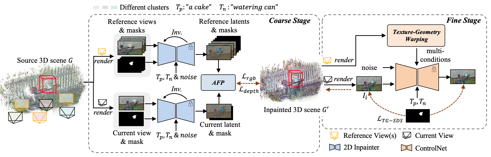

# 🪄DiGA3D: Coarse-to-Fine Diffusional Propagation of Geometry and Appearance for Versatile 3D Inpainting

### [Project Page](https://rorisis.github.io/DiGA3D/) 

> DiGA3D: Coarse-to-Fine Diffusional Propagation of Geometry and Appearance for Versatile 3D Inpainting 
> 
> Jingyi Pan, Dan Xu, Qiong Luo.
>
> ICCV 2025
> 

## To-do

- [ ] Release code.
- [ ] Release test samples.

Code will be released. Please stay tuned.